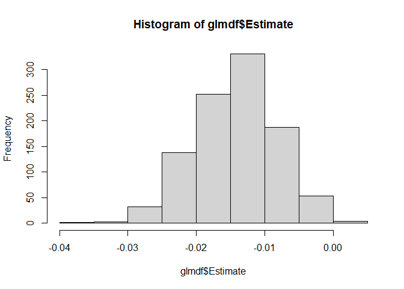

Bootstrap & MCMC Tutorial
================

# Background

## Randomization techniques: why do we use them?

Data resampling and randomization methods are most often used for

1.  Evaluating uncertainty levels in data

2.  Hypothesis testing

3.  Improving model fit/performance

Common methods include

- **Bootstrapping**: “pulling yourself up by your bootstraps”; pulling
  random samples from your data to *evaluate* the distribution of
  metrics of interest and obtain *confidence intervals* for computed
  statistics

- **Permutations**: randomizing your data by keeping some parameters
  constant and varying others, then comparing to a null distribution to
  ask if your data structure differs significantly from the null
  expectation; i.e., *hypothesis testing*

- **Markov Chains**: simulate different possible values of model
  parameters through random sampling, incorporating fixed and random
  effects; can *improve model performance* when chains are mixed well.
  This method is based on Bayesian inference, but for the way we will
  use it in this tutorial, it basically is just a juiced-up generalized
  linear mixed effects model (GLMM).

# Tutorial

## Example dataset

The dataset we will use for the tutorial shows feeder visitations by
birds in mixed-species flocks in Lincoln, Nebraska. This a summarized
version of that dataset which aggregates each individual’s number of
morning visitations (sumvisits) and compares them to the lowest
temperature from the previous night. If you would like to learn more
about the original study, you can find it here:
<https://academic.oup.com/beheco/article/32/3/407/6163219> and the full
dataset and code for its analysis can be found here:
<https://datadryad.org/stash/dataset/doi:10.5061/dryad.x69p8czgr>

The original study used a Markov Chain Monte Carlo model to test the
effects of overnight temperature on morning feeder visitation by birds
in mixed-species flocks. Here, we will be adding a component not used in
the original study to demonstrate bootstrapping. The original study also
used permutations to test if pairs of birds with a strong social
connection had similar foraging activity. The network permutations will
not be covered in this tutorial, but the necessary code can be found
through the dryad link above.

We will start the tutorial with bootstrapping then move to Markov
Chains.

## Bootstrapping

### Data visualization and exploration

First, we need to load the visitation data and investigate the variables
of interest, “sumvisits” (feeder visitation) and “nightlows” (the lowest
overnight temperature)

    ##         Date       RFID Species Sex sumvisits  nightlows
    ## 1 2019-01-27 011016B9B5    WBNU   M        11  -6.722222
    ## 2 2019-01-29 011016B9B5    WBNU   M         1 -18.888889
    ## 3 2019-01-30 011016B9B5    WBNU   M        21 -22.222222
    ## 4 2019-01-31 011016B9B5    WBNU   M        14 -17.777778
    ## 5 2019-02-01 011016B9B5    WBNU   M        13 -11.722222
    ## 6 2019-02-02 011016B9B5    WBNU   M         2   1.111111

<!-- -->

    ## [1] 33.39792

<!-- -->

    ## [1] -12.90478

<!-- -->

### Simple model

Now that we know our data a little better, let’s start by running a
simple generalized linear model to test the effects of overnight
temperature on feeder visitation.

    ## 
    ## Call:
    ## glm(formula = sumvisits ~ nightlows, family = "poisson", data = morn_visits)
    ## 
    ## Coefficients:
    ##             Estimate Std. Error z value Pr(>|z|)    
    ## (Intercept)  3.32029    0.01644  202.01   <2e-16 ***
    ## nightlows   -0.01434    0.00114  -12.58   <2e-16 ***
    ## ---
    ## Signif. codes:  0 '***' 0.001 '**' 0.01 '*' 0.05 '.' 0.1 ' ' 1
    ## 
    ## (Dispersion parameter for poisson family taken to be 1)
    ## 
    ##     Null deviance: 16371  on 768  degrees of freedom
    ## Residual deviance: 16211  on 767  degrees of freedom
    ## AIC: 20001
    ## 
    ## Number of Fisher Scoring iterations: 5

<!-- -->

Let’s look at the residuals to assess model fit. The fitted vs. residual
plot should have no clear trend and there should be a normal
distribution of the residuals.

<!-- --><!-- -->

Let’s look at the quantiles to assess model fit. The theoretical and
sample quantiles should fall along the normal quantiles line.

<!-- -->

Hm, it’s not a perfect model fit. The residuals aren’t quite a normal
distribution and our Q-Q plot is not quite a straight line. Maybe the
model assumptions aren’t met or the distribution is thrown off by
something. Let’s see if we can improve model fit.

### Bootstrap a simple statistic

First, to demonstrate the logic behind bootstrapping, let’s bootstrap a
simple statistic to evaluate our distributions and accuracy. To do this
we are going to build a simple function to resample the data and
calculate a bootstrap statistic.

Now look at the distribution of values.

<!-- -->

Calculate the 95% confidence intervals.

    ##     2.5%    97.5% 
    ## 5.275811 5.780584

This example should help you understand some of the logic behind
bootstrapping. However, you don’t have to write your own function for
everything–there are also premade packages in R for bootstrapping,
including the *mosaic* package (see here for a specific tutorial on
*mosaic* <https://rpubs.com/robbsinn/s11>) and the *boot* package
<https://www.mayin.org/ajayshah/KB/R/documents/boot.html>. These use
wrappers to apply different statistics to your data. They also have a
wider variety of options to fine-tune your resampling methods for simple
statistics.

    ## starting httpd help server ... done

    ## Warning: package 'mosaic' was built under R version 4.3.3

    ## Registered S3 method overwritten by 'mosaic':
    ##   method                           from   
    ##   fortify.SpatialPolygonsDataFrame ggplot2
    ## 
    ## The 'mosaic' package masks several functions from core packages in order to add 
    ## additional features.  The original behavior of these functions should not be affected by this.
    ## 
    ## Attaching package: 'mosaic'
    ## 
    ## The following objects are masked from 'package:dplyr':
    ## 
    ##     count, do, tally
    ## 
    ## The following object is masked from 'package:Matrix':
    ## 
    ##     mean
    ## 
    ## The following object is masked from 'package:ggplot2':
    ## 
    ##     stat
    ## 
    ## The following object is masked from 'package:boot':
    ## 
    ##     logit
    ## 
    ## The following objects are masked from 'package:stats':
    ## 
    ##     binom.test, cor, cor.test, cov, fivenum, IQR, median, prop.test,
    ##     quantile, sd, t.test, var
    ## 
    ## The following objects are masked from 'package:base':
    ## 
    ##     max, mean, min, prod, range, sample, sum

### Bootstrap model outputs

Now let’s apply the same logic to the GLM to get a bootstrapped model
parameter and calculate confidence intervals. We will do this for our
response estimate. Basically, we will run the model a bunch of times,
resampling the data each time and grabbing our parameter of interest.

    ## ── Attaching core tidyverse packages ──────────────────────── tidyverse 2.0.0 ──
    ## ✔ forcats   1.0.0     ✔ stringr   1.5.0
    ## ✔ lubridate 1.9.2     ✔ tibble    3.2.1
    ## ✔ purrr     1.0.1     ✔ tidyr     1.3.0
    ## ✔ readr     2.1.4     
    ## ── Conflicts ────────────────────────────────────────── tidyverse_conflicts() ──
    ## ✖ mosaic::count() masks dplyr::count()
    ## ✖ purrr::cross()  masks mosaic::cross()
    ## ✖ mosaic::do()    masks dplyr::do()
    ## ✖ tidyr::expand() masks Matrix::expand()
    ## ✖ dplyr::filter() masks stats::filter()
    ## ✖ dplyr::lag()    masks stats::lag()
    ## ✖ tidyr::pack()   masks Matrix::pack()
    ## ✖ mosaic::stat()  masks ggplot2::stat()
    ## ✖ mosaic::tally() masks dplyr::tally()
    ## ✖ tidyr::unpack() masks Matrix::unpack()
    ## ℹ Use the conflicted package (<http://conflicted.r-lib.org/>) to force all conflicts to become errors

    ##         2.5%        97.5% 
    ## -0.025744856 -0.003013217

<!-- -->

## Markov Chain Monte Carlo (MCMC) GLMM

Now let’s try a different randomization method that also incorporates
more complexity from our data. We initially built a simple model with
only a response and a single predictor. But in this dataset, we also
know there are individuals that may differ in their behavior and we
might expect that behavior differs by day, depending on flockmates and
other factors. We can incorporate that complexity into the model and
into the randomization process itself with MCMC.

Let’s run through the logic for MCMC before we continue. These models
are complex, and the function we will use “black-boxes” the methods.

    ## Warning: package 'MCMCglmm' was built under R version 4.3.2

    ## Loading required package: coda

    ## Warning: package 'coda' was built under R version 4.3.2

    ## Loading required package: ape

    ## 
    ## Attaching package: 'ape'

    ## The following object is masked from 'package:dplyr':
    ## 
    ##     where

The way that MCMC randomizes data is actually by simulating a new data
“chain” using a probability of moving from one point to another. As the
data is simulated, we might find that data points simulated one after
the other are dependent on the previous point. This is important to know
because one of the assumptions of a linear model is that data points are
independent of each other. To account for this, we can discard every nth
data point to maintain independence. We can adjust this with the “thin”
argument.

It’s also possible that when the chain starts, its first set of
simulated data points are less random than as the simulation continues.
We may then want to discard osbervations from the beginning of the
chain. We can adjust this using the “burnin” argument.

One great thing about the MCMCMglmm package is that it has nifty
built-in functions to run diagnostic tests to find the best parameters
for the model. We can find the optimum burn-in period, sample size
(total), and dependence factor (nth step without losing important info).

    ## 
    ## Quantile (q) = 0.05
    ## Accuracy (r) = +/- 0.005
    ## Probability (s) = 0.95 
    ## 
    ## You need a sample size of at least 7299 with these values of q, r and s

    ## Warning: Unknown or uninitialised column: `family`.

    ## 
    ##                        MCMC iteration = 0
    ## 
    ##  Acceptance ratio for liability set 1 = 0.000315
    ## 
    ##                        MCMC iteration = 1000
    ## 
    ##  Acceptance ratio for liability set 1 = 0.397322
    ## 
    ##                        MCMC iteration = 2000
    ## 
    ##  Acceptance ratio for liability set 1 = 0.400381
    ## 
    ##                        MCMC iteration = 3000
    ## 
    ##  Acceptance ratio for liability set 1 = 0.401224
    ## 
    ##                        MCMC iteration = 4000
    ## 
    ##  Acceptance ratio for liability set 1 = 0.400049
    ## 
    ##                        MCMC iteration = 5000
    ## 
    ##  Acceptance ratio for liability set 1 = 0.399919
    ## 
    ##                        MCMC iteration = 6000
    ## 
    ##  Acceptance ratio for liability set 1 = 0.399849
    ## 
    ##                        MCMC iteration = 7000
    ## 
    ##  Acceptance ratio for liability set 1 = 0.400805

Let’s look at the residuals. Again, there should be no clear trends–the
messier, the better.

<!-- -->

These look pretty good.

We can also check overdispersed points to see if there is overlap; this
estimates how much between-chain variance could be reduced if the chains
were run longer.

    ## , , (Intercept)
    ## 
    ##         (Intercept)     nightlows
    ## Lag 0   1.000000000  0.6843990990
    ## Lag 1   0.008967196  0.0114472219
    ## Lag 5   0.006243232 -0.0002864469
    ## Lag 10 -0.019514316 -0.0056234806
    ## Lag 50 -0.016862066 -0.0234951404
    ## 
    ## , , nightlows
    ## 
    ##          (Intercept)    nightlows
    ## Lag 0   0.6843990990  1.000000000
    ## Lag 1   0.0110591045  0.015821868
    ## Lag 5   0.0156491389  0.011861528
    ## Lag 10 -0.0083865158  0.008530944
    ## Lag 50  0.0005504137 -0.004213824

There is very low autocorrelation between points, so that is good.

We can also check model performance by running multiple chains and
making sure they are all well mixed. We will use parallel processing to
make this part go faster.

    ## Loading required package: foreach

    ## 
    ## Attaching package: 'foreach'

    ## The following objects are masked from 'package:purrr':
    ## 
    ##     accumulate, when

    ## Loading required package: iterators

    ## Loading required package: parallel

    ## ##------ Mon Jun 24 09:48:35 2024 ------##

    ## ##------ Mon Jun 24 09:48:41 2024 ------##

    ## Potential scale reduction factors:
    ## 
    ##             Point est. Upper C.I.
    ## (Intercept)          1       1.01
    ## nightlows            1       1.00
    ## 
    ## Multivariate psrf
    ## 
    ## 1

<!-- -->

The basic procedure I described was adopted from ECOLOGICAL MODELS AND
DATA IN R: 7.3 - MARKOV CHAIN MONTE CARLO (PAGE 233). There are many
more details there. I also used a custom function from an intro to
MCMCglmm resource, which follows this same procedure and adds some more
details. You should peruse to find more examples and more detailed
explanation: <https://github.com/tmalsburg/MCMCglmm-intro>. And one more
resource:
<http://cran.nexr.com/web/packages/MCMCglmm/vignettes/CourseNotes.pdf>

Another great resource for understanding these types of Bayesian models
is Richard McElreath’s Statistical Rethinking course:
<https://github.com/rmcelreath/stat_rethinking_2023>.  
